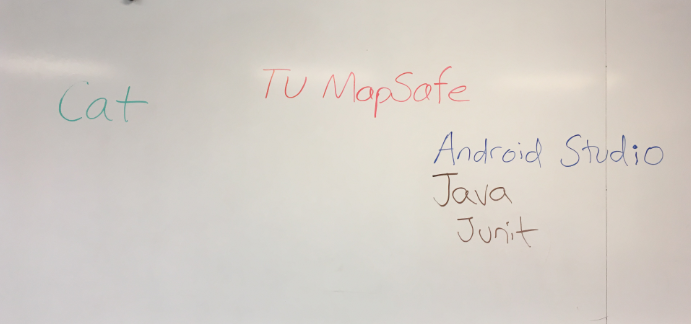

# TU MapSafe
## A Web Application for the Temple Community to increase the utility and value of Temple's Existing Safety and Security Resources. 

### The key novel features of TU MapSafe are the following:
- present TU alerts through a map interface 
- provide options to directly place call from the app to the Temple Police, the Philadelphia Police and the Temple Walking Escort program
- provide integrated options to send a "crime tip" to the Temple Police either anonymously through a web form or through an email  
- store TU alerts and allow for the display of a map with accumulated historical alerts

## Project Abstract Final
As the project shifted to a web application, there were changes to the scope and design plans of the initial abstract. 
The following aspects remained consistent:
- the graphical presentation of TU alerts on a map that also includes a marker for the user's location to gauge proximity and respond accordingly
- calling directly from the app is included, but swiping is not the mechanism as it is a web based app

## Project Abstract Initial
The goal for the project is to design an Android application to connect Temple campus users with existing safety and security services for increased safety and increased experience of feeling safe on and around the campus: 
- by way of a user-friendly mapped interface
- swipe to corner dialing to emergency and non-emergency professionals
- the app should receive TU alerts and represent their locations on the campus map in red 
- when an alert is resolved it should then be displayed with a green marker
- incidents (whether or not resolved) will be automatically removed from the map after they have aged by some fixed time interval
- app will also show the user's own location (as determined bytheir device GPS) on his/her own running MapSafe app map screen to allow users to better grasp the specific location of a TU alert and also their own proximity to said alert
- 

## Project Development Process
Features were developed discretely, tested and then added to the app as functionality expanded through our develoment timeframe.
Project Management tools were be utilized -- a Trello Board was used to establish and prioritize a backlog for Sprints
Version Control tools will be utilized -- GitHub repository accessed by all team members
Team communication tools will be utilized to reduce the need for face to face meetings, as all team members have unique schedules and demands on their time -- What's App initially, them moved to Discord where both text and voice were used and files and images shared regularly. We broke out subteams as well when appropriate within our Discord group. 

## Evolution of the Project
TU MapSafe was initially proposed as a Mobile App with the intention to code the project in Android Studio. Very early in the first sprint, the collective decision was made to switch the project plan to design a web app, as opposed to the Mobile App. 
This decision was unanimously agreed to, and the flexibility and communication of the entire team made this quick redirection possible and successful.

## Teamwork
The team established multiple open and accessible communication channels with one another from day one. All team members had voice, email and Discord access to one another. No communication problems changed the 
This focus on keeping constant communication, as well as the early group decision to pivot to a web app were unquestionably critical factors to the ultimate success of the team's efforts to achieve a working product aligned with the initial vision which our group had formulated together. 

## Final Use Case Diagram from Proposal 

## Initial Use Case Diagram from Proposal 

## Required Skills and Resources
The group required experience (or acquiring experience) in the following areas:
- coding Angular apps
- user interfaces 
- mapping applications
- GPS
- linkages between the app and user device in order to contact emergency services
- user experience design
- visual design particularly in relation to website best practices

The project development and project itself utilize the following technogies and resources:
- Angular Framework 
- Typescript
- HTML
- CSS using Bootstrap
- mapping was done using Angular Google Maps (AGM)
- the alerts database for storing TU alert messages uses Firebase
- Python was used to parse emails in order to grab the alerts from an email account estabished for TUmapsafe

## Project Vision
FOR Temple University members WHO want to feel more secure, TU MapSafe is an application THAT can more intuitively and effortlessly interpret TU Alerts and provide access to Temple Campus Police.
UNLIKE the existing campus alert notification system, OUR PRODUCT provides a GUI that makes clear to the user their proximity to the incident, threat, etc. so that they can react accordingly. 

## Personas 
The following user personas represent the slight variations in the use cases and greatest benefit to user to be gained from our application. They are all Temple Campus community members, but their needs may vary slightly and our research from User Experience Design surveying indicates that these different user populations report different levels of comfort/safety and different levels of safety on and around the campus. 

## Persona 1
### Angela
Angela is a sophomore at Temple University and she is a Film and Media Arts major. 
In her free time, Angela likes to watch foreign movies, come up with short film ideas, and play video games. 
She also has an active social life and enjoys getting out and making the most of her college years.

Angela was born and raised in northwestern Pennsylvania. 
She lived on campus during her freshman year but now she lives in a small apartment in northern Philadelphia 
near campus because she finds it to be more convenient and cost-effective. 
She rides a bicycle to and from her classes almost every day 
(with the exception of severe weather days, during which she takes public transportation) 
since she lives far enough that walking would be a burden but close enough that bicycling would be better than taking a bus or train. 

Angela has not fully acclimated to the city yet since she is relatively new to Philadelphia. 
She still doesn’t know as much about the city as she wants to know so she needs help feeling safer 
when she’s going back to her apartment after some late activities on campus or a late night out with her friends. 
She doesn’t want the fear of the unknown to come in the way of her studies or her social life.

## Persona 2
### Bill, a student 
Bill, is 18 years old and freshman at Temple University and he is a computer science major. He likes to watch films, play video games and hang out with his colleagues. Bill is from New York and lives in apartment in north Philadelphia near the university because of the time management. He walks to and from classes every day to save time and money. 

Bill is new to the city and he does not know the area where he lives that well. He takes 5 classes which he ends up going home late at night. Therefore, he wants to explore the city, so he needs help feeling safer when he is going back to his apartment. He wants to use technology which would help him to feel secure while walking and which area to avoid from the risk. 

## Persona 3
### David

## Person 4
### Tam
Tam is a freshamn transfer student from India he is new to America and is excited to be studying at Temple. He lives on campus and walks to class each day. He lives slightly off campus and has to walk 15 minutes to and from his classes each day. During the summer he lives with his Aunt and Uncles that live in King of Prussia. He has heard some rumors about the safety around campus and is a bit nervous about starting the spring semester, because he has a night class. Tam isn't yet familiar with the community around campus and is never quite sure where the TUalerts he receives are located, making him feel even more uncomfotable. Tam wishes he had a way to see the best way to walk to and from campus when a TUalert is active. 

## Persona 5

## Persona 6

## TU MapSafe Project Team
Cat Schaper

Joe Ciccone

Jay Patel

Meet Patel 

Saad Khan
