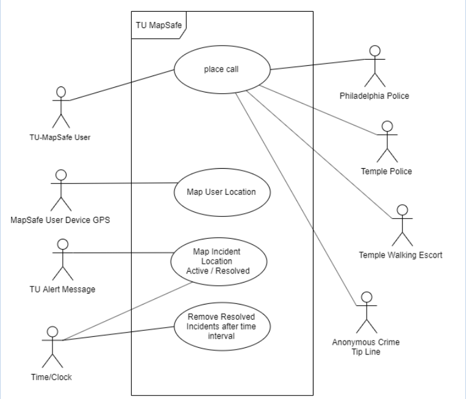
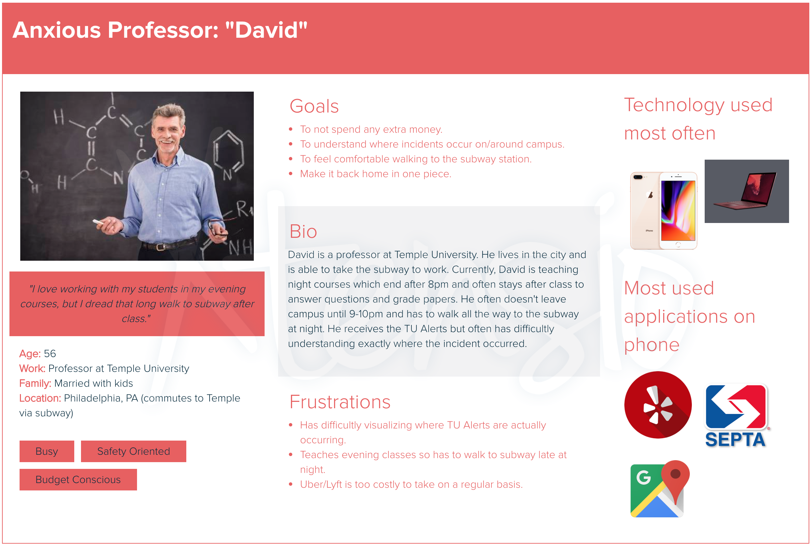

# TU MapSafe
## A Temple Campus Safety Mapping Mobile Application
## Project Abstract Final
_The goal for the project is to design an Angular web application to connect Temple campus users with existing safety and security services by way of a user-friendly mapped interface and swipe to corner dialing to emergency and non-emergency professionals for increased sense of safety. Additionally the app should receive TU alerts and represent their locations on the campus map in red when under alert and in green when the incident is updated to resolved status. Subsequently such resolved incidents will be automatically removed from the map after they have aged by some fixed/determined time interval. The app will also use the user's own location as determined by device GPS to represent each user on his/her own running MapSafe app to better grasp both the specific locations and the proximity of TU alerts regarding addresses not readily recognizable to many persons at Temple._ 

## Project Abstract Initial
The goal for the project is to design an Angular web application to connect Temple campus users with existing safety and security services for increased safety and increased experience of feeling safe on and around the campus: 
- by way of a user-friendly mapped interface
- swipe to corner dialing to emergency and non-emergency professionals  Additionally 
- the app should receive TU alerts and represent their locations on the campus map in red 
- when an alert is resolved it should then be displayed with a green marker Subsequently such 
- incidents (whether or not resolved) will be automatically removed from the map after they have aged by some fixed time interval
- app will also use the user's own location as determined bytheir device GPS to represent each user on his/her own running MapSafe app home map page in order to better grasp both the specific location of a given alert and also their own proximity to said alert

## Project Relevance
This project will use Object Oriented Design, and a Test Driven Design process. Features will be added and tested separately as the app's functionality is expanding through the development timeframe. Project Management and Version Control tools will be utilized. 
The translation of TU alerts from text to locations is an area of uncertainty as the possibility of obtaining location data directly in a more readily map-able form has yet to be explored. 

## Conceptual Design
_This is a proposal is for an original open source project._

## Background
_This project does not exist at present as no code has been written._

## Use Case Diagram

## Required Skills and Resources
The group will need people with (or willing to acquire) experience in the following areas:
- coding Angular apps
- user interfaces 
- mapping applications
- GPS
- linkages between the app and user device in order to contact emergency services
- user experience design
- visual design particularly in relation to website best practices

The project will uses technogies and resources including:
- Angular
- Typescript
- html and css
- and 3rd party app interfacing tools for map rendering (specifics to be determined)

## Project Vision

FOR Temple University members WHO want to feel more secure, TU MapSafe is an application THAT can more intuitively and effortlessly interpret TU Alerts and provide access to Temple Campus Police.
UNLIKE the existing campus alert notification system, OUR PRODUCT provides a GUI that makes clear to the user their proximity to the incident, threat, etc. so that they can react accordingly. 

## Personas 
The following user personas represent the slight variations in the use cases and greatest benefit to user to be gained from our application. They are all Temple Campus community members, but their needs may vary slightly and our research from User Experience Design surveying indicates that these different user populations report different levels of comfort/safety and different levels of safety on and around the campus. 

### Angela 
Angela is a sophomore at Temple University and she is a Film and Media Arts major. 
In her free time, Angela likes to watch foreign movies, come up with short film ideas, and play video games. 
She also has an active social life and enjoys getting out and making the most of her college years.

Angela was born and raised in northwestern Pennsylvania. 
She lived on campus during her freshman year but now she lives in a small apartment in northern Philadelphia 
near campus because she finds it to be more convenient and cost-effective. 
She rides a bicycle to and from her classes almost every day 
(with the exception of severe weather days, during which she takes public transportation) 
since she lives far enough that walking would be a burden but close enough that bicycling would be better than taking a bus or train. 

Angela has not fully acclimated to the city yet since she is relatively new to Philadelphia. 
She still doesn’t know as much about the city as she wants to know so she needs help feeling safer 
when she’s going back to her apartment after some late activities on campus or a late night out with her friends. 
She doesn’t want the fear of the unknown to come in the way of her studies or her social life.

## Persona 2
### Bill, a student 
Bill, is 18 years old and freshman at Temple University and he is a computer science major. He likes to watch films, play video games and hang out with his colleagues. Bill is from New York and lives in apartment in north Philadelphia near the university because of the time management. He walks to and from classes every day to save time and money. 

Bill is new to the city and he does not know the area where he lives that well. He takes 5 classes which he ends up going home late at night. Therefore, he wants to explore the city, so he needs help feeling safer when he is going back to his apartment. He wants to use technology which would help him to feel secure while walking and which area to avoid from the risk. 

## Persona 3
### David

## Person 4
### Tam
Tam is a freshamn transfer student from India he is new to America and is excited to be studying at Temple. He lives on campus and walks to class each day. He lives slightly off campus and has to walk 15 minutes to and from his classes each day. During the summer he lives with his Aunt and Uncles that live in King of Prussia. He has heard some rumors about the safety around campus and is a bit nervous about starting the spring semester, because he has a night class. Tam isn't yet familiar with the community around campus and is never quite sure where the TUalerts he receives are located, making him feel even more uncomfotable. Tam wishes he had a way to see the best way to walk to and from campus when a TUalert is active. 

## Persona 5

## Persona 6

